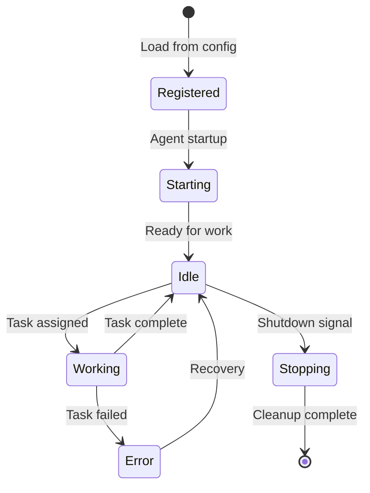

# Agent Development Guide

> **Purpose**: Complete guide for creating custom agents in Agent-Forge, from concept to production.

**Last Updated**: 2025-10-09

---

## 🎯 Overview

Agent-Forge agents are **role-based, event-driven workers** that respond to GitHub issues, PRs, and internal events. This guide walks through creating a custom agent from scratch.

**Agent Types**:
- **Developer Agent**: Writes code, fixes bugs, implements features
- **Bot Agent**: GitHub operations (issues, PRs, comments)
- **Reviewer Agent**: Code review, quality checks
- **Tester Agent**: Runs tests, validates changes
- **Documenter Agent**: Writes/updates documentation
- **Researcher Agent**: Gathers information, analyzes context
- **Coordinator Agent**: Orchestrates multi-agent workflows

---

## 🏗️ Agent Architecture

### Agent Lifecycle



### Agent Interface

Every agent implements these core methods:

```python
class BaseAgent:
    """Base class for all agents"""
    
    def __init__(self, agent_id: str, config: dict):
        """Initialize agent with ID and configuration"""
        pass
    
    def start(self) -> bool:
        """Start agent (called once on initialization)"""
        pass
    
    def stop(self) -> bool:
        """Stop agent gracefully (cleanup resources)"""
        pass
    
    def handle_task(self, task: Task) -> TaskResult:
        """Process a single task (main work method)"""
        pass
    
    def get_status(self) -> AgentStatus:
        """Return current agent status"""
        pass
    
    def health_check(self) -> HealthStatus:
        """Check if agent is healthy"""
        pass
```

---

## 🚀 Quick Start: Hello World Agent

### Step 1: Create Agent File

```python
# engine/runners/hello_runner.py

import logging
from typing import Optional
from dataclasses import dataclass

logger = logging.getLogger(__name__)

@dataclass
class Task:
    task_id: str
    task_type: str
    payload: dict

@dataclass
class TaskResult:
    success: bool
    message: str
    output: Optional[dict] = None

class HelloAgent:
    """Simple agent that greets issues"""
    
    def __init__(self, agent_id: str, config: dict):
        self.agent_id = agent_id
        self.config = config
        self.status = "initializing"
        self.current_task = None
        
        logger.info(f"✅ HelloAgent {agent_id} initialized")
    
    def start(self) -> bool:
        """Start the agent"""
        self.status = "idle"
        logger.info(f"✅ HelloAgent {self.agent_id} started")
        return True
    
    def stop(self) -> bool:
        """Stop the agent"""
        self.status = "stopped"
        logger.info(f"✅ HelloAgent {self.agent_id} stopped")
        return True
    
    def handle_task(self, task: Task) -> TaskResult:
        """Process a task"""
        self.status = "working"
        self.current_task = task
        
        try:
            logger.info(f"🔍 Processing task {task.task_id}")
            
            # Extract issue info
            issue_number = task.payload.get('issue_number')
            repo = task.payload.get('repo')
            
            # Generate greeting
            greeting = f"Hello from {self.agent_id}! 👋\n\n"
            greeting += f"I'm processing issue #{issue_number} in {repo}.\n"
            greeting += "Thanks for using Agent-Forge!"
            
            logger.info(f"✅ Task {task.task_id} completed")
            
            self.status = "idle"
            self.current_task = None
            
            return TaskResult(
                success=True,
                message="Greeting posted successfully",
                output={"greeting": greeting}
            )
            
        except Exception as e:
            logger.error(f"❌ Task {task.task_id} failed: {e}")
            self.status = "error"
            return TaskResult(
                success=False,
                message=f"Error: {e}"
            )
    
    def get_status(self) -> dict:
        """Get current agent status"""
        return {
            "agent_id": self.agent_id,
            "status": self.status,
            "current_task": self.current_task.task_id if self.current_task else None
        }
    
    def health_check(self) -> dict:
        """Check agent health"""
        return {
            "healthy": self.status != "error",
            "status": self.status
        }
```

### Step 2: Register Agent in Config

```yaml
# config/agents/hello-agent.yaml

agents:
  - agent_id: hello-agent
    name: Hello World Agent
    agent_type: hello              # Match to runner type
    enabled: true
    auto_start: true               # Start immediately
    
    # Agent-specific config
    greeting_prefix: "Hello from Agent-Forge"
    
    # GitHub integration (if needed)
    github_token: null              # Loaded from secrets/
    
    # Permissions
    permissions:
      read_code: true
      write_code: false
      execute_commands: false
      create_comments: true
```

### Step 3: Register Runner in Agent Registry

```python
# engine/core/agent_registry.py

from engine.runners.hello_runner import HelloAgent

AGENT_RUNNERS = {
    'code': CodeRunner,
    'bot': BotRunner,
    'coordinator': CoordinatorRunner,
    'hello': HelloAgent,           # Add your agent
}
```

### Step 4: Test Your Agent

```python
# tests/test_hello_agent.py

import pytest
from engine.runners.hello_runner import HelloAgent, Task

def test_hello_agent_initialization():
    """Test agent initializes correctly"""
    agent = HelloAgent("test-hello", {})
    assert agent.agent_id == "test-hello"
    assert agent.status == "initializing"

def test_hello_agent_start():
    """Test agent starts successfully"""
    agent = HelloAgent("test-hello", {})
    assert agent.start() == True
    assert agent.status == "idle"

def test_hello_agent_handle_task():
    """Test agent processes task"""
    agent = HelloAgent("test-hello", {})
    agent.start()
    
    task = Task(
        task_id="test-1",
        task_type="greeting",
        payload={
            "issue_number": 42,
            "repo": "m0nk111/agent-forge"
        }
    )
    
    result = agent.handle_task(task)
    
    assert result.success == True
    assert "Hello from test-hello" in result.output["greeting"]
    assert agent.status == "idle"

def test_hello_agent_health_check():
    """Test health check"""
    agent = HelloAgent("test-hello", {})
    agent.start()
    
    health = agent.health_check()
    assert health["healthy"] == True
    assert health["status"] == "idle"
```

### Step 5: Run Your Agent

```bash
# Start service with your agent
python -m engine.core.service_manager

# Check agent status
curl http://localhost:8080/agents | jq '.agents[] | select(.agent_id=="hello-agent")'

# Manually trigger a task (for testing)
curl -X POST http://localhost:8080/agents/hello-agent/task \
  -H "Content-Type: application/json" \
  -d '{
    "task_id": "test-1",
    "task_type": "greeting",
    "payload": {
      "issue_number": 42,
      "repo": "m0nk111/agent-forge"
    }
  }'
```

---

## 🎨 Advanced: Real-World Agent Example

### Documentation Agent

This agent automatically improves documentation based on code changes.

```python
# engine/runners/documenter_runner.py

import os
import logging
from typing import List, Dict, Optional
from dataclasses import dataclass

from engine.operations.file_editor import FileEditor
from engine.operations.github_api_helper import GitHubAPIHelper
from engine.operations.llm_file_editor import LLMFileEditor

logger = logging.getLogger(__name__)

@dataclass
class DocumentationTask:
    """Documentation task"""
    repo: str
    pr_number: int
    changed_files: List[str]
    commit_messages: List[str]

class DocumenterAgent:
    """Agent that writes and updates documentation"""
    
    def __init__(self, agent_id: str, config: dict):
        self.agent_id = agent_id
        self.config = config
        self.status = "initializing"
        
        # Initialize tools
        self.file_editor = FileEditor()
        self.github = GitHubAPIHelper(config.get('github_token'))
        self.llm = LLMFileEditor(config.get('llm_model', 'qwen2.5-coder:7b'))
        
        logger.info(f"✅ DocumenterAgent {agent_id} initialized")
    
    def start(self) -> bool:
        """Start agent"""
        self.status = "idle"
        logger.info(f"✅ DocumenterAgent started")
        return True
    
    def stop(self) -> bool:
        """Stop agent"""
        self.status = "stopped"
        logger.info(f"✅ DocumenterAgent stopped")
        return True
    
    def handle_task(self, task: DocumentationTask) -> TaskResult:
        """Generate/update documentation for code changes"""
        self.status = "working"
        
        try:
            logger.info(f"🔍 Analyzing PR #{task.pr_number} in {task.repo}")
            
            # 1. Analyze changed files
            code_files = [f for f in task.changed_files if f.endswith('.py')]
            logger.info(f"🔍 Found {len(code_files)} Python files changed")
            
            # 2. Identify documentation gaps
            missing_docs = []
            for code_file in code_files:
                doc_file = self._get_doc_path(code_file)
                if not os.path.exists(doc_file):
                    missing_docs.append((code_file, doc_file))
            
            logger.info(f"🔍 Found {len(missing_docs)} files missing documentation")
            
            # 3. Generate documentation
            generated_docs = []
            for code_file, doc_file in missing_docs:
                logger.info(f"📝 Generating docs for {code_file}")
                
                # Read source code
                with open(code_file, 'r') as f:
                    code_content = f.read()
                
                # Generate documentation via LLM
                prompt = f"""
                Analyze this Python code and write comprehensive documentation:
                
                File: {code_file}
                
                ```python
                {code_content}
                ```
                
                Generate documentation in Markdown format including:
                1. Module overview
                2. Class descriptions
                3. Function signatures and parameters
                4. Usage examples
                5. Common pitfalls
                """
                
                doc_content = self.llm.generate(prompt)
                
                # Write documentation file
                os.makedirs(os.path.dirname(doc_file), exist_ok=True)
                with open(doc_file, 'w') as f:
                    f.write(doc_content)
                
                generated_docs.append(doc_file)
                logger.info(f"✅ Generated {doc_file}")
            
            # 4. Update CHANGELOG.md
            self._update_changelog(task, generated_docs)
            
            # 5. Commit documentation
            self._commit_documentation(generated_docs)
            
            self.status = "idle"
            
            return TaskResult(
                success=True,
                message=f"Generated {len(generated_docs)} documentation files",
                output={"generated_docs": generated_docs}
            )
            
        except Exception as e:
            logger.error(f"❌ Documentation generation failed: {e}")
            self.status = "error"
            return TaskResult(success=False, message=f"Error: {e}")
    
    def _get_doc_path(self, code_file: str) -> str:
        """Convert code file path to doc file path"""
        # engine/runners/foo_runner.py -> docs/API_FOO_RUNNER.md
        base_name = os.path.basename(code_file).replace('.py', '').upper()
        return f"docs/API_{base_name}.md"
    
    def _update_changelog(self, task: DocumentationTask, docs: List[str]):
        """Add changelog entry"""
        entry = f"- **Documentation**: Generated docs for {len(docs)} modules (PR #{task.pr_number})\n"
        
        with open('DOCS_CHANGELOG.md', 'r') as f:
            content = f.read()
        
        # Insert after first heading
        lines = content.split('\n')
        insert_index = next(i for i, line in enumerate(lines) if line.startswith('##')) + 1
        lines.insert(insert_index, entry)
        
        with open('DOCS_CHANGELOG.md', 'w') as f:
            f.write('\n'.join(lines))
        
        logger.info(f"✅ Updated DOCS_CHANGELOG.md")
    
    def _commit_documentation(self, docs: List[str]):
        """Commit generated documentation"""
        import subprocess
        
        # Add files
        subprocess.run(['git', 'add'] + docs + ['DOCS_CHANGELOG.md'], check=True)
        
        # Commit
        commit_msg = f"docs: auto-generate documentation for {len(docs)} modules\n\nAgent: {self.agent_id}"
        subprocess.run(['git', 'commit', '-m', commit_msg], check=True)
        
        logger.info(f"✅ Committed documentation")
    
    def get_status(self) -> dict:
        """Get agent status"""
        return {
            "agent_id": self.agent_id,
            "status": self.status,
            "docs_generated": getattr(self, 'docs_count', 0)
        }
    
    def health_check(self) -> dict:
        """Health check"""
        # Check if LLM is accessible
        try:
            self.llm.health_check()
            llm_healthy = True
        except:
            llm_healthy = False
        
        return {
            "healthy": self.status != "error" and llm_healthy,
            "status": self.status,
            "llm_accessible": llm_healthy
        }
```

---

## 🧪 Testing Best Practices

### Unit Tests

```python
# tests/test_documenter_agent.py

import pytest
from unittest.mock import Mock, patch
from engine.runners.documenter_runner import DocumenterAgent, DocumentationTask

@pytest.fixture
def agent():
    """Create test agent"""
    config = {
        'github_token': 'test-token',
        'llm_model': 'qwen2.5-coder:7b'
    }
    return DocumenterAgent("test-documenter", config)

def test_agent_initialization(agent):
    """Test agent initializes with correct tools"""
    assert agent.agent_id == "test-documenter"
    assert agent.file_editor is not None
    assert agent.github is not None
    assert agent.llm is not None

@patch('engine.runners.documenter_runner.LLMFileEditor')
def test_generate_documentation(mock_llm, agent, tmp_path):
    """Test documentation generation"""
    # Mock LLM response
    mock_llm.return_value.generate.return_value = "# Test Documentation\n\nThis is a test."
    
    # Create test code file
    code_file = tmp_path / "test_module.py"
    code_file.write_text("def hello(): pass")
    
    # Create task
    task = DocumentationTask(
        repo="test/repo",
        pr_number=42,
        changed_files=[str(code_file)],
        commit_messages=["Add hello function"]
    )
    
    # Process task
    result = agent.handle_task(task)
    
    # Verify
    assert result.success == True
    assert len(result.output['generated_docs']) == 1

def test_health_check_when_llm_unavailable(agent):
    """Test health check detects LLM issues"""
    with patch.object(agent.llm, 'health_check', side_effect=Exception("LLM down")):
        health = agent.health_check()
        assert health['healthy'] == False
        assert health['llm_accessible'] == False
```

### Integration Tests

```python
# tests/integration/test_documenter_integration.py

import pytest
from engine.runners.documenter_runner import DocumenterAgent

@pytest.mark.integration
@pytest.mark.slow
def test_full_documentation_workflow(tmp_path):
    """Test complete documentation workflow with real LLM"""
    # This test requires Ollama running
    agent = DocumenterAgent("integration-test", {
        'llm_model': 'qwen2.5-coder:7b'
    })
    
    # Create real code file
    code_file = tmp_path / "example.py"
    code_file.write_text("""
def calculate_sum(a: int, b: int) -> int:
    '''Calculate sum of two numbers'''
    return a + b

class Calculator:
    '''Simple calculator class'''
    def add(self, a, b):
        return a + b
    """)
    
    # Create task
    task = DocumentationTask(
        repo="test/repo",
        pr_number=1,
        changed_files=[str(code_file)],
        commit_messages=["Add calculator"]
    )
    
    # Execute
    result = agent.handle_task(task)
    
    # Verify
    assert result.success == True
    
    # Check generated doc exists and has content
    doc_file = tmp_path / "docs" / "API_EXAMPLE.md"
    assert doc_file.exists()
    assert len(doc_file.read_text()) > 100  # Has substantial content
```

---

## 🔧 Agent Configuration

### Configuration Schema

```yaml
agents:
  - agent_id: my-agent           # Unique identifier
    name: My Custom Agent         # Display name
    agent_type: custom            # Type (maps to runner)
    enabled: true                 # Enable/disable
    auto_start: true              # Start on service boot
    
    # Lifecycle
    lifecycle: on_demand          # always_on | on_demand
    timeout_seconds: 1800         # 30 minutes
    
    # LLM configuration
    llm_provider: local           # local | openai | anthropic
    llm_model: qwen2.5-coder:7b
    llm_temperature: 0.7
    llm_max_tokens: 4096
    
    # GitHub integration
    github_token: null            # Loaded from secrets/
    github_username: my-agent-bot
    
    # Permissions
    permissions:
      read_code: true
      write_code: true
      execute_commands: false
      create_commits: true
      create_pull_requests: true
      review_pull_requests: false
      manage_issues: true
    
    # Agent-specific config
    custom_setting: value
```

### Loading Configuration

```python
from engine.core.config_manager import ConfigManager

class MyAgent:
    def __init__(self, agent_id: str, config: dict):
        self.agent_id = agent_id
        self.config = config
        
        # Access standard config
        self.llm_model = config.get('llm_model', 'qwen2.5-coder:7b')
        self.timeout = config.get('timeout_seconds', 1800)
        
        # Access custom config
        self.custom_setting = config.get('custom_setting', 'default')
        
        # Load GitHub token from secrets
        config_manager = ConfigManager()
        self.github_token = config_manager.load_agent_token(agent_id)
```

---

## 📚 Related Documentation

- [ARCHITECTURE.md](../ARCHITECTURE.md) - System architecture overview
- [AGENT_ROLES.md](AGENT_ROLES.md) - Agent role definitions
- [TESTING.md](TESTING.md) - Testing strategies
- [ERROR_RECOVERY.md](ERROR_RECOVERY.md) - Error handling patterns

---

**Guide Version**: 1.0  
**Last Updated**: 2025-10-09  
**Maintained by**: Agent Forge Development Team
