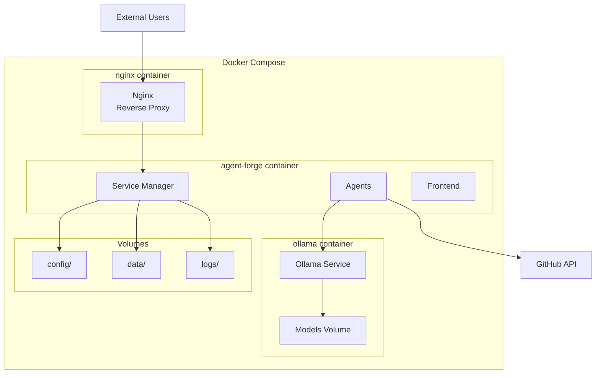

# Agent-Forge System Diagrams - Enterprise Edition

> **Complete visual documentation of Agent-Forge multi-agent platform**

## 📋 Diagram Index

1. [High-Level System Architecture](#high-level-system-architecture)
2. [Deployment Architecture](#deployment-architecture)
3. [Agent Lifecycle State Machine](#agent-lifecycle-state-machine)
4. [Request Flow Sequence](#request-flow-sequence)
5. [WebSocket Communication](#websocket-communication)
6. [Configuration Management](#configuration-management)
7. [Error Handling Flow](#error-handling-flow)
8. [Security Architecture](#security-architecture)
9. [Database Schema](#database-schema)
10. [CI/CD Pipeline](#cicd-pipeline)

---

## 1. High-Level System Architecture

---

## 2. Deployment Architecture

### 2.1 Development Deployment

### 2.2 Production Deployment (Systemd)

### 2.3 Docker Deployment (Planned)

---

## 3. Agent Lifecycle State Machine

---

## 4. Request Flow Sequence

### 4.1 Issue Processing Flow

### 4.2 Manual Task Assignment

---

## 5. WebSocket Communication

### WebSocket Message Types

---

## 6. Configuration Management

---

## 7. Error Handling Flow

---

## 8. Security Architecture

---

## 9. Database Schema

---

## 10. CI/CD Pipeline

---

## Usage Guide

### Viewing Diagrams

1. **GitHub**: Diagrams render automatically in Markdown
2. **VS Code**: Install "Markdown Preview Mermaid Support" extension
3. **Documentation Sites**: Use mermaid.js integration
4. **Export**: Use mermaid-cli to export as PNG/SVG

### Updating Diagrams

When system architecture changes:

1. Update relevant diagram(s) in this file
2. Update ARCHITECTURE.md references
3. Commit with descriptive message
4. Update CHANGELOG.md

### Diagram Conventions

- **Solid arrows** (→): Direct dependencies/calls
- **Dashed arrows** (-.->): Optional/conditional
- **Bold boxes**: Critical components
- **Subgraphs**: Logical grouping
- **Colors**: (When rendered)
  - Blue: External systems
  - Green: Services
  - Orange: Data stores
  - Red: Security/error paths

---

**Last Updated**: October 6, 2025  
**Diagram Count**: 10 core diagrams + 3 existing = 13 total  
**Coverage**: Complete system visualization
