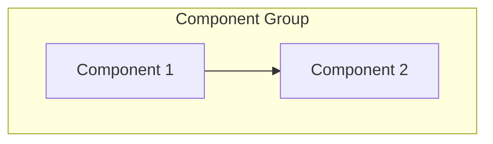
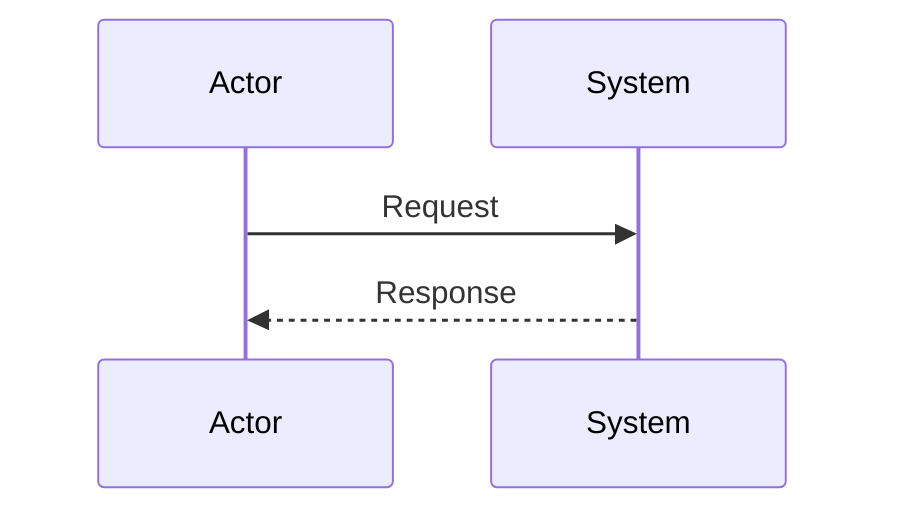
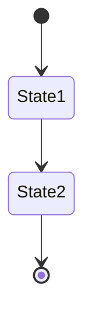

# Agent-Forge Visual Documentation Index 🎨

> **Complete visual reference for the Agent-Forge multi-agent platform**

## 📊 Diagram Overview

Agent-Forge has **13 comprehensive diagrams** covering all aspects of the system architecture, deployment, and workflows.

---

## 🗺️ Quick Navigation

### Architecture & Design (5 diagrams)

- [Architecture Overview](architecture-overview.md) - System components and relationships
- [Component Interactions](component-interactions.md) - Detailed component communication
- [Data Flow](data-flow.md) - Information flow through the system
- [Agent Lifecycle](ENTERPRISE_DIAGRAMS.md#3-agent-lifecycle-state-machine) - State machine for agent behavior
- [Database Schema](ENTERPRISE_DIAGRAMS.md#9-database-schema) - Data model and relationships

### Deployment & Infrastructure (3 diagrams)

- [Deployment Architecture](ENTERPRISE_DIAGRAMS.md#2-deployment-architecture) - Dev, Systemd, and Docker deployments
- [Security Architecture](ENTERPRISE_DIAGRAMS.md#8-security-architecture) - Security layers and controls
- [Configuration Management](ENTERPRISE_DIAGRAMS.md#6-configuration-management) - Config sources and priority

### Communication & Flows (4 diagrams)

- [Request Flow Sequence](ENTERPRISE_DIAGRAMS.md#4-request-flow-sequence) - Issue processing and task assignment
- [WebSocket Communication](ENTERPRISE_DIAGRAMS.md#5-websocket-communication) - Real-time updates protocol
- [Error Handling Flow](ENTERPRISE_DIAGRAMS.md#7-error-handling-flow) - Error classification and recovery
- [CI/CD Pipeline](ENTERPRISE_DIAGRAMS.md#10-cicd-pipeline) - Development and deployment workflow

### System Context (1 diagram)

- [High-Level System](ENTERPRISE_DIAGRAMS.md#1-high-level-system-architecture) - C4 context diagram

---

## 📖 Diagram Catalog

### 1. Architecture Overview

**File**: [architecture-overview.md](architecture-overview.md)  
**Type**: Component diagram  
**Purpose**: Shows all system components and their relationships  
**Key Elements**:

- GitHub integration
- Service Manager (Port 8080)
- Agents (Bot, Coordinator, Code)
- Frontend (Port 8897)
- Ollama integration (Port 11434)

**Use Cases**:

- Onboarding new developers
- System architecture presentations
- High-level understanding

---

### 2. Component Interactions

**File**: [component-interactions.md](component-interactions.md)  
**Type**: Interaction diagram  
**Purpose**: Detailed view of how components communicate  
**Key Elements**:

- Agent communication patterns
- API call flows
- Event propagation
- Service dependencies

**Use Cases**:

- Understanding inter-component communication
- Debugging integration issues
- Planning new features

---

### 3. Data Flow

**File**: [data-flow.md](data-flow.md)  
**Type**: Flow diagram  
**Purpose**: Shows how data moves through the system  
**Key Elements**:

- Issue detection flow
- Code generation pipeline
- PR creation process
- Monitoring data flow

**Use Cases**:

- Tracing data paths
- Performance optimization
- Understanding workflows

---

### 4. Agent Lifecycle State Machine

**File**: [ENTERPRISE_DIAGRAMS.md#3](ENTERPRISE_DIAGRAMS.md#3-agent-lifecycle-state-machine)  
**Type**: State diagram  
**Purpose**: Agent behavior and state transitions  
**Key States**:

- Created → Idle → Working → Error
- Task processing states
- Error recovery paths

**Use Cases**:

- Understanding agent behavior
- Debugging agent stuck states
- Planning state management

---

### 5. Request Flow Sequence

**File**: [ENTERPRISE_DIAGRAMS.md#4](ENTERPRISE_DIAGRAMS.md#4-request-flow-sequence)  
**Type**: Sequence diagram  
**Purpose**: Detailed request/response flows  
**Key Flows**:

- Issue processing (end-to-end)
- Manual task assignment
- API interactions with timing

**Use Cases**:

- Understanding timing and order
- Debugging workflow issues
- API integration planning

---

### 6. WebSocket Communication

**File**: [ENTERPRISE_DIAGRAMS.md#5](ENTERPRISE_DIAGRAMS.md#5-websocket-communication)  
**Type**: Sequence diagram  
**Purpose**: Real-time communication protocol  
**Key Elements**:

- Connection establishment
- Message types (ping, agent_state, log, system)
- Heartbeat mechanism
- Reconnection logic

**Use Cases**:

- Implementing WebSocket clients
- Debugging connection issues
- Understanding real-time updates

---

### 7. Deployment Architecture

**File**: [ENTERPRISE_DIAGRAMS.md#2](ENTERPRISE_DIAGRAMS.md#2-deployment-architecture)  
**Type**: Deployment diagram  
**Purpose**: Shows different deployment scenarios  
**Scenarios**:

- Development (local)
- Production (systemd + nginx)
- Docker (planned)

**Use Cases**:

- Planning deployments
- Infrastructure setup
- Scaling strategies

---

### 8. Configuration Management

**File**: [ENTERPRISE_DIAGRAMS.md#6](ENTERPRISE_DIAGRAMS.md#6-configuration-management)  
**Type**: Flow diagram  
**Purpose**: Configuration sources and precedence  
**Key Elements**:

- Priority order (CLI > ENV > YAML > Defaults)
- Config validation
- Runtime updates

**Use Cases**:

- Understanding config override behavior
- Troubleshooting configuration issues
- Planning config changes

---

### 9. Error Handling Flow

**File**: [ENTERPRISE_DIAGRAMS.md#7](ENTERPRISE_DIAGRAMS.md#7-error-handling-flow)  
**Type**: Flow diagram  
**Purpose**: Error classification and recovery  
**Key Elements**:

- Retryable vs permanent errors
- Exponential backoff
- Notification channels
- Cleanup procedures

**Use Cases**:

- Implementing error handling
- Debugging failures
- Planning resilience

---

### 10. Security Architecture

**File**: [ENTERPRISE_DIAGRAMS.md#8](ENTERPRISE_DIAGRAMS.md#8-security-architecture)  
**Type**: Security diagram  
**Purpose**: Security layers and controls  
**Key Layers**:

- Network security (firewall, nginx, SSL)
- Application security (auth, validation)
- Service security (systemd sandbox)
- Data security (secrets, permissions)

**Use Cases**:

- Security audits
- Compliance documentation
- Hardening planning

---

### 11. Database Schema

**File**: [ENTERPRISE_DIAGRAMS.md#9](ENTERPRISE_DIAGRAMS.md#9-database-schema)  
**Type**: ERD (Entity-Relationship Diagram)  
**Purpose**: Data model and relationships  
**Key Entities**:

- Agents
- Tasks
- Task History
- Logs
- Repositories
- Configuration

**Use Cases**:

- Database design
- Query optimization
- Data migration planning

---

### 12. CI/CD Pipeline

**File**: [ENTERPRISE_DIAGRAMS.md#10](ENTERPRISE_DIAGRAMS.md#10-cicd-pipeline)  
**Type**: Pipeline diagram  
**Purpose**: Development and deployment workflow  
**Key Stages**:

- Lint & Format (Ruff, Black, mypy)
- Testing (unit, integration, coverage)
- Security (dependency check, secret scanning)
- Code review (human + Copilot)
- Merge & Deploy

**Use Cases**:

- Understanding PR workflow
- Setting up CI/CD
- Contributing guidelines

---

### 13. High-Level System Context

**File**: [ENTERPRISE_DIAGRAMS.md#1](ENTERPRISE_DIAGRAMS.md#1-high-level-system-architecture)  
**Type**: C4 Context diagram  
**Purpose**: System in its environment  
**Key Elements**:

- User personas (Developer, Maintainer)
- External systems (GitHub, Ollama)
- System boundaries
- Relationships

**Use Cases**:

- Executive presentations
- System overview
- Stakeholder communication

---

## 🎯 Diagram Usage by Role

### Developers

**Start Here**: [Architecture Overview](architecture-overview.md)  
**Then Review**:

1. [Component Interactions](component-interactions.md)
2. [Data Flow](data-flow.md)
3. [Request Flow Sequence](ENTERPRISE_DIAGRAMS.md#4-request-flow-sequence)
4. [Agent Lifecycle](ENTERPRISE_DIAGRAMS.md#3-agent-lifecycle-state-machine)

### DevOps/SRE

**Start Here**: [Deployment Architecture](ENTERPRISE_DIAGRAMS.md#2-deployment-architecture)  
**Then Review**:

1. [Security Architecture](ENTERPRISE_DIAGRAMS.md#8-security-architecture)
2. [Configuration Management](ENTERPRISE_DIAGRAMS.md#6-configuration-management)
3. [Error Handling Flow](ENTERPRISE_DIAGRAMS.md#7-error-handling-flow)

### Contributors

**Start Here**: [CI/CD Pipeline](ENTERPRISE_DIAGRAMS.md#10-cicd-pipeline)  
**Then Review**:

1. [Architecture Overview](architecture-overview.md)
2. [Component Interactions](component-interactions.md)
3. [Database Schema](ENTERPRISE_DIAGRAMS.md#9-database-schema)

### Managers/Architects

**Start Here**: [High-Level System Context](ENTERPRISE_DIAGRAMS.md#1-high-level-system-architecture)  
**Then Review**:

1. [Architecture Overview](architecture-overview.md)
2. [Deployment Architecture](ENTERPRISE_DIAGRAMS.md#2-deployment-architecture)
3. [Security Architecture](ENTERPRISE_DIAGRAMS.md#8-security-architecture)

---

## 🛠️ Working with Diagrams

### Viewing Diagrams

#### GitHub

All diagrams render automatically in GitHub's Markdown viewer.

#### VS Code

Install extension: [Markdown Preview Mermaid Support](https://marketplace.visualstudio.com/items?itemName=bierner.markdown-mermaid)

```bash
code --install-extension bierner.markdown-mermaid
```

#### Command Line Export

```bash
# Install mermaid-cli
npm install -g @mermaid-js/mermaid-cli

# Export to PNG
mmdc -i ENTERPRISE_DIAGRAMS.md -o diagrams.png

# Export to SVG
mmdc -i ENTERPRISE_DIAGRAMS.md -o diagrams.svg

# Export to PDF
mmdc -i ENTERPRISE_DIAGRAMS.md -o diagrams.pdf
```

#### Online Editor

Use [Mermaid Live Editor](https://mermaid.live) for interactive editing and export.

---

### Updating Diagrams

When making changes:

1. **Identify affected diagrams**: Changes may impact multiple diagrams
2. **Update all relevant diagrams**: Keep consistency across docs
3. **Update ARCHITECTURE.md**: If structural changes occurred
4. **Test rendering**: Verify diagrams render correctly
5. **Update CHANGELOG.md**: Document diagram changes
6. **Commit with clear message**: e.g., "docs(diagrams): update deployment architecture for Docker support"

---

## 📐 Diagram Conventions

### Visual Language

| Element       | Meaning              |
| ------------- | -------------------- |
| **Rectangle** | Component/Service    |
| **Cylinder**  | Database/Storage     |
| **Cloud**     | External Service     |
| **Actor**     | User/External System |
| **Diamond**   | Decision Point       |
| **Circle**    | State                |

### Arrow Types

| Arrow  | Meaning                |
| ------ | ---------------------- |
| `-->`  | Direct call/dependency |
| `-.->` | Optional/conditional   |
| `==>`  | Data flow              |
| `..>`  | Asynchronous           |

### Colors (when rendered)

| Color      | Usage              |
| ---------- | ------------------ |
| **Blue**   | External systems   |
| **Green**  | Services/processes |
| **Orange** | Data stores        |
| **Red**    | Security/errors    |
| **Gray**   | Infrastructure     |

---

## 📚 Related Documentation

- [ARCHITECTURE.md](../ARCHITECTURE.md) - Detailed technical architecture
- [CONTRIBUTING.md](../../CONTRIBUTING.md) - Development workflow
- [DEPLOYMENT.md](../DEPLOYMENT.md) - Deployment guides
- [API.md](../API.md) - REST API reference
- [TROUBLESHOOTING.md](../TROUBLESHOOTING.md) - Problem solving

---

## 📊 Diagram Statistics

| Category       | Count  | Lines     | Files |
| -------------- | ------ | --------- | ----- |
| Architecture   | 5      | ~800      | 3     |
| Deployment     | 3      | ~400      | 1     |
| Communication  | 4      | ~600      | 1     |
| System Context | 1      | ~100      | 1     |
| **Total**      | **13** | **~1900** | **4** |

---

## 🎨 Diagram Templates

### Creating New Diagrams

When adding new diagrams, use these templates:

#### Component Diagram



#### Sequence Diagram



#### State Diagram



---

## ✅ Diagram Checklist

Before committing diagram changes:

- [ ] Diagram renders correctly in GitHub
- [ ] All text is readable
- [ ] Arrows show correct direction
- [ ] Legend/key included (if needed)
- [ ] Referenced in index (this file)
- [ ] Related docs updated
- [ ] CHANGELOG.md entry added
- [ ] Commit message follows conventions

---

**Last Updated**: October 6, 2025  
**Total Diagrams**: 13  
**Maintained By**: Agent-Forge Contributors  
**License**: AGPL-3.0

_For questions or improvements, open an issue on GitHub._
