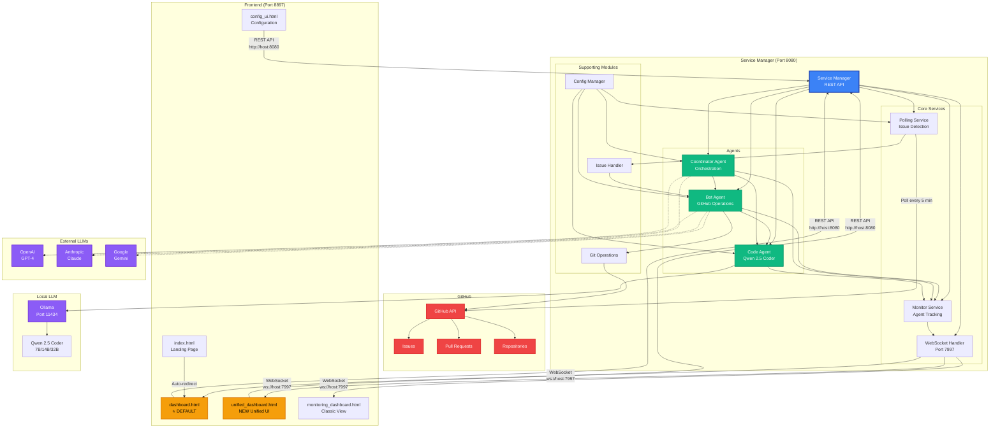

# Agent-Forge Architecture Overview

> **Visual representation of the Agent-Forge system architecture**

## System Architecture Diagram



## Component Descriptions

### Service Manager (Port 8080)
**Central orchestrator** that manages all services and agents. Provides REST API for external control.

**Key Responsibilities**:
- Start/stop all services
- Health monitoring
- Configuration management
- Graceful shutdown handling
- Systemd integration

### Core Services

#### Polling Service
- Polls GitHub repositories every 5 minutes
- Detects new issues assigned to bot accounts
- Triggers issue handler workflows
- Manages GitHub API rate limits

#### Monitor Service
- Tracks agent states (idle, working, error)
- Collects metrics (CPU, memory, API calls)
- Broadcasts state updates via WebSocket
- Stores historical data

#### WebSocket Handler (Port 7997)
- Real-time bidirectional communication
- Broadcasts agent state updates
- Streams logs to dashboards
- Handles multiple client connections

### Agents

#### Bot Agent
- **Purpose**: GitHub operations executor
- **LLM**: Any (GPT-4, Claude, Qwen)
- **Tasks**: Issue processing, branch creation, commits, PR management

#### Coordinator Agent
- **Purpose**: High-level orchestration
- **LLM**: High-capability models (GPT-4, Claude Opus)
- **Tasks**: Task distribution, workflow management, decision-making

#### Code Agent (Qwen)
- **Purpose**: Code generation and analysis
- **LLM**: Qwen 2.5 Coder (local via Ollama)
- **Tasks**: Code generation, refactoring, documentation

### Frontend (Port 8897)

#### dashboard.html ⭐ **DEFAULT**
- Main entry point after `index.html` redirect
- Agent overview and basic monitoring
- Live status indicators
- Quick actions

#### unified_dashboard.html (NEW)
- Modern unified interface
- Agent configuration modal
- Real-time log streaming
- Sliding sidebar for settings

#### monitoring_dashboard.html
- Classic monitoring view
- Detailed metrics and graphs
- Historical data visualization

#### config_ui.html
- YAML configuration editor
- Agent settings management
- Validation and apply

## Data Flow Paths

### Issue Processing Flow
```
GitHub Issue → Polling Service → Issue Handler → Bot Agent → Code Agent → Git Operations → GitHub API
```

### Monitoring Flow
```
Agent State Change → Monitor Service → WebSocket Handler → Frontend Dashboards
```

### Configuration Flow
```
config_ui.html → REST API (/api/config) → Config Manager → Service Manager → Agents Reload
```

## Port Allocation

| Port | Service | Protocol | Access |
|------|---------|----------|--------|
| **8080** | Service Manager | HTTP | REST API |
| **7997** | WebSocket | WebSocket | Real-time updates |
| **8897** | Frontend | HTTP | Dashboard hosting |
| 11434 | Ollama | HTTP | Local LLM inference |

## Network Topology

```
┌─────────────────────────────────────────┐
│  LAN Network (192.168.1.x)              │
│                                         │
│  ┌─────────────┐      ┌──────────────┐ │
│  │ Your PC     │      │ Other Device │ │
│  │ Agent-Forge │◄────►│ Browser      │ │
│  │             │      │              │ │
│  │ 0.0.0.0:8897│      │              │ │
│  │ 0.0.0.0:7997│      │              │ │
│  └─────────────┘      └──────────────┘ │
│         │                               │
└─────────┼───────────────────────────────┘
          │
          ▼
    ┌──────────┐
    │ Internet │
    │ GitHub   │
    └──────────┘
```

## Technology Stack

### Backend
- **Language**: Python 3.12+
- **Async**: asyncio, aiohttp
- **WebSocket**: FastAPI WebSockets
- **LLM**: Ollama (local), OpenAI API, Anthropic API

### Frontend
- **HTML/CSS/JavaScript**: Vanilla (no frameworks)
- **WebSocket**: Native WebSocket API
- **Styling**: Custom CSS with dark theme

### Infrastructure
- **Process Manager**: systemd
- **Logging**: Python logging + systemd journal
- **Config**: YAML files
- **Git**: GitPython

## Related Diagrams

- [Data Flow Diagram](data-flow.md) - Detailed data flow through the system
- [Component Interactions](component-interactions.md) - How components communicate

## See Also

- [ARCHITECTURE.md](../../ARCHITECTURE.md) - Complete architecture documentation
- [AGENT_ONBOARDING.md](../AGENT_ONBOARDING.md) - Quick start for new agents
- [PORT_REFERENCE.md](../PORT_REFERENCE.md) - Port allocation guide

---

**Last Updated**: 2025-10-06  
**Maintained by**: Agent-Forge Team
