# Agent-Forge Component Interactions

> **Detailed diagrams showing how components communicate and orchestrate**

## Table of Contents

1. [Service Manager Orchestration](#service-manager-orchestration)
2. [Agent Communication Patterns](#agent-communication-patterns)
3. [Configuration Management](#configuration-management)
4. [Monitoring Integration](#monitoring-integration)
5. [Error Handling Flow](#error-handling-flow)

---

## Service Manager Orchestration

### Service Lifecycle Management

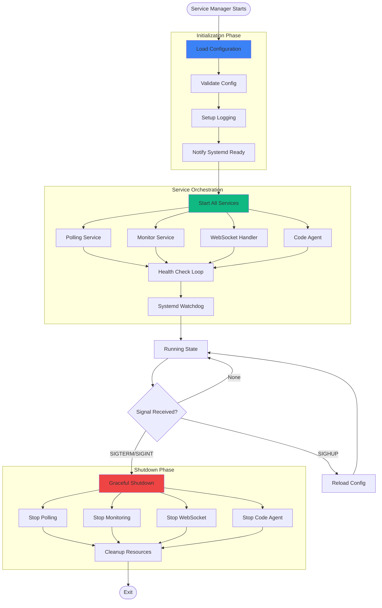

### Service Dependencies

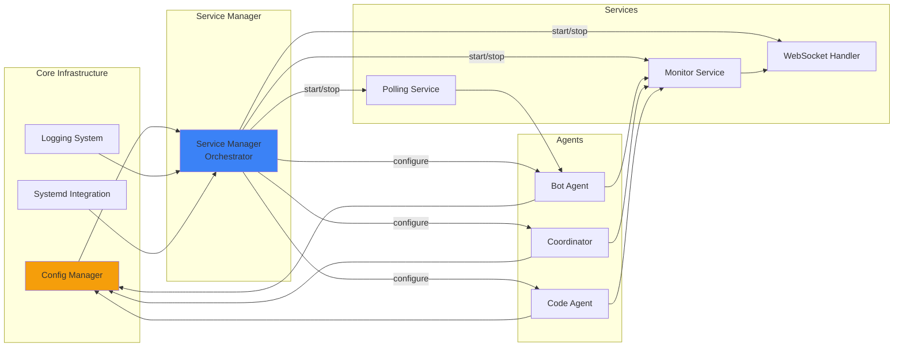

---

## Agent Communication Patterns

### Inter-Agent Communication

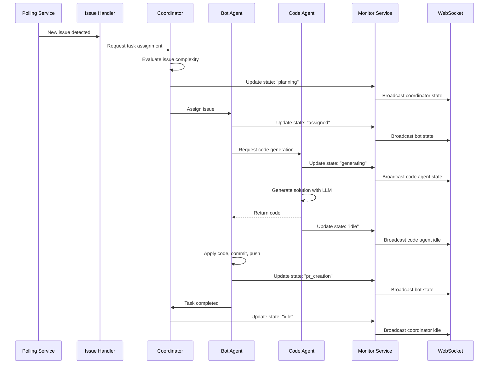

### Message Passing Architecture

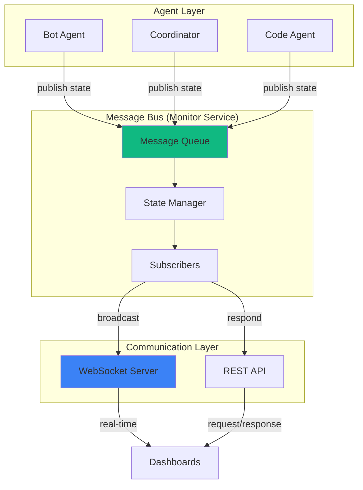

---

## Configuration Management

### Configuration Load and Apply

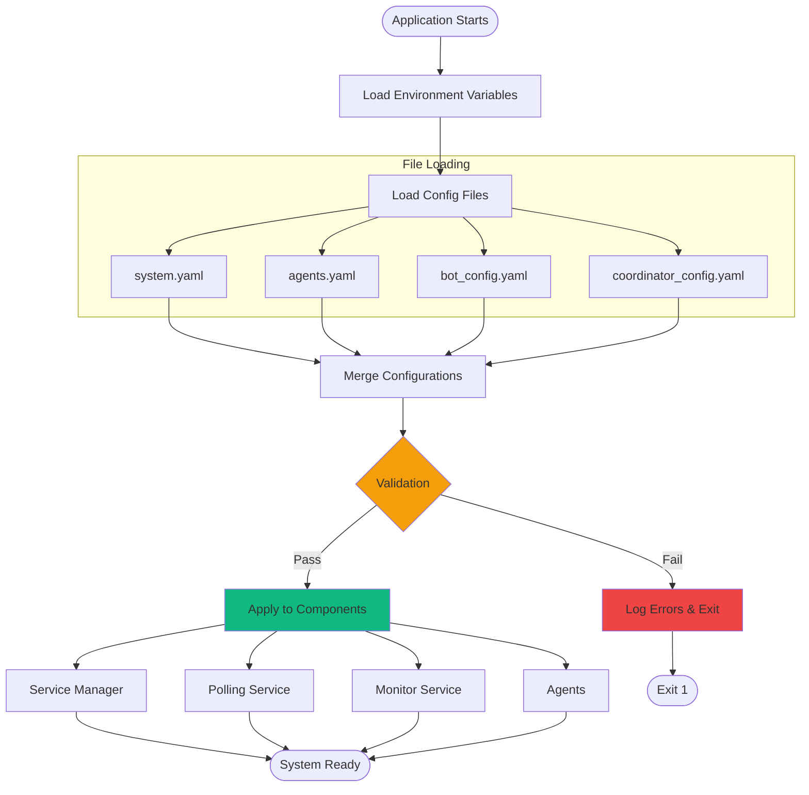

### Runtime Configuration Update

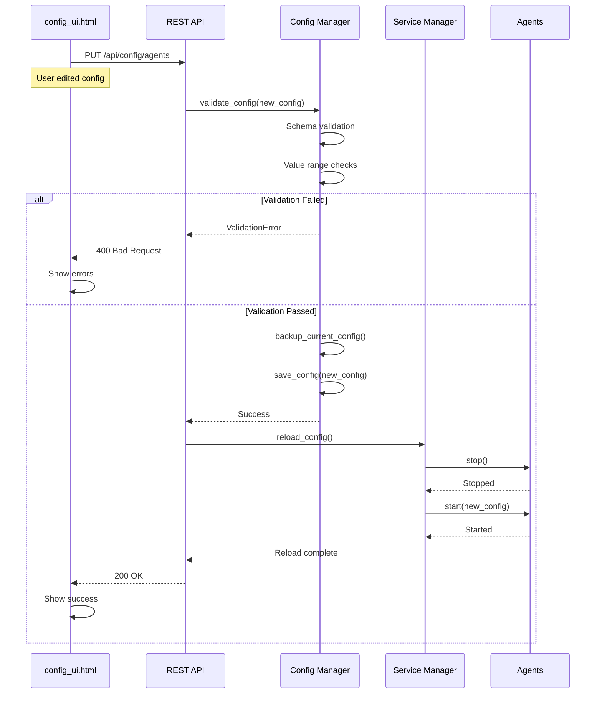

---

## Monitoring Integration

### Agent State Tracking

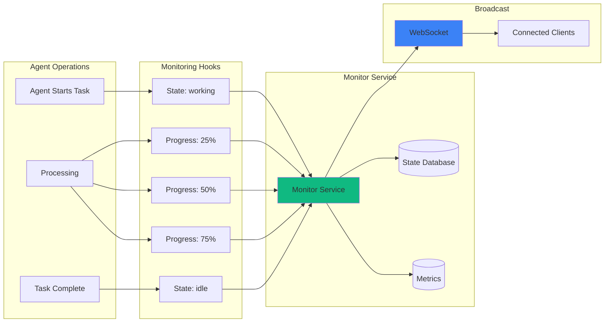

### Metrics Collection

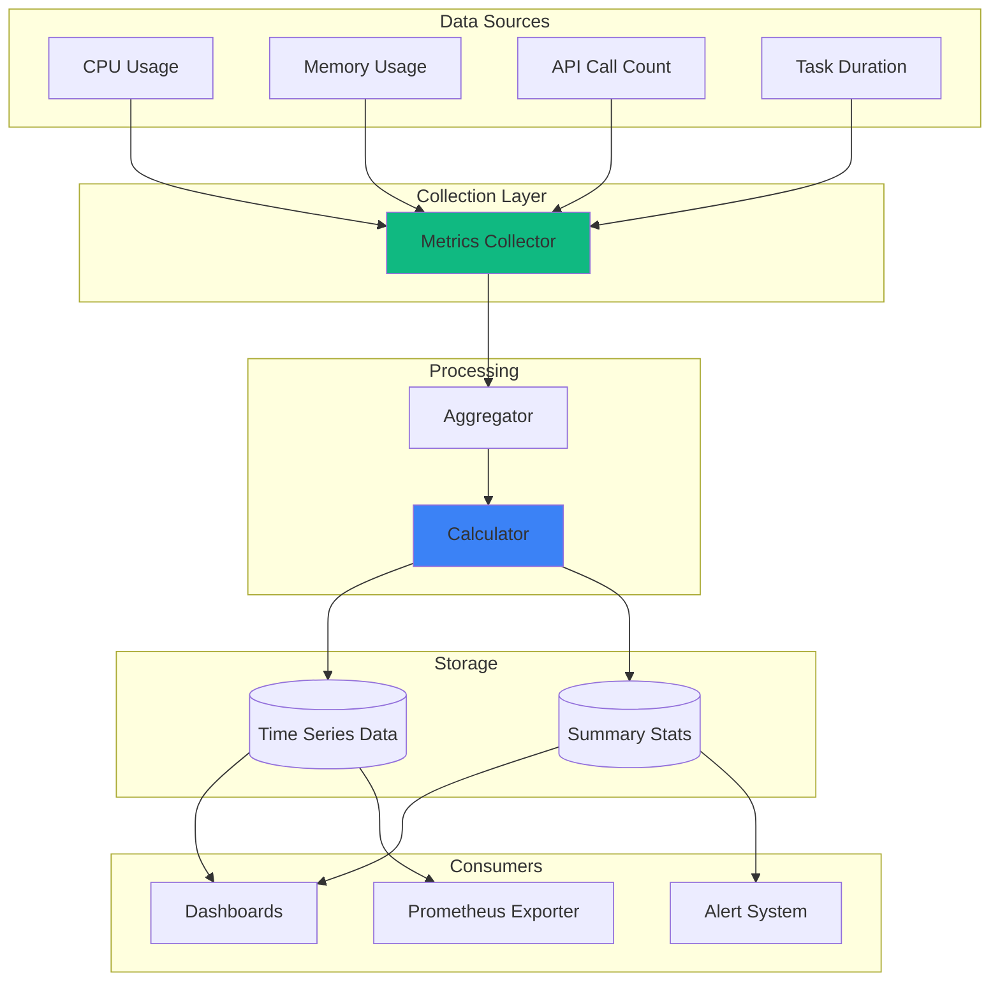

---

## Error Handling Flow

### Error Propagation

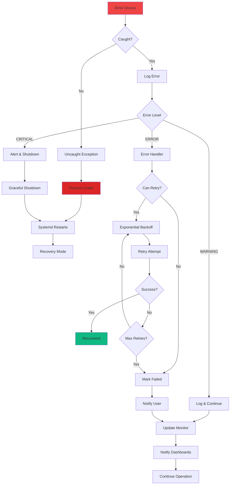

### Retry Strategy

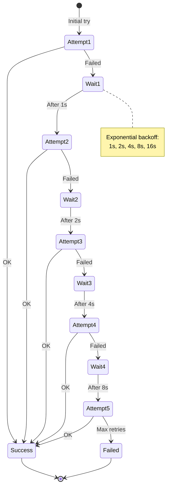

---

## WebSocket Communication Patterns

### Connection Management

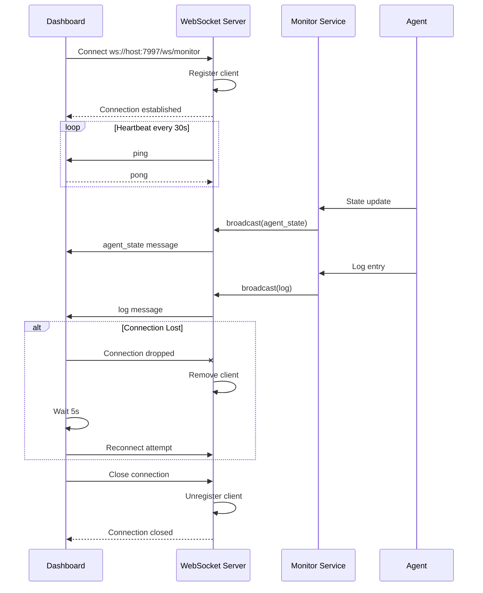

### Broadcast Pattern

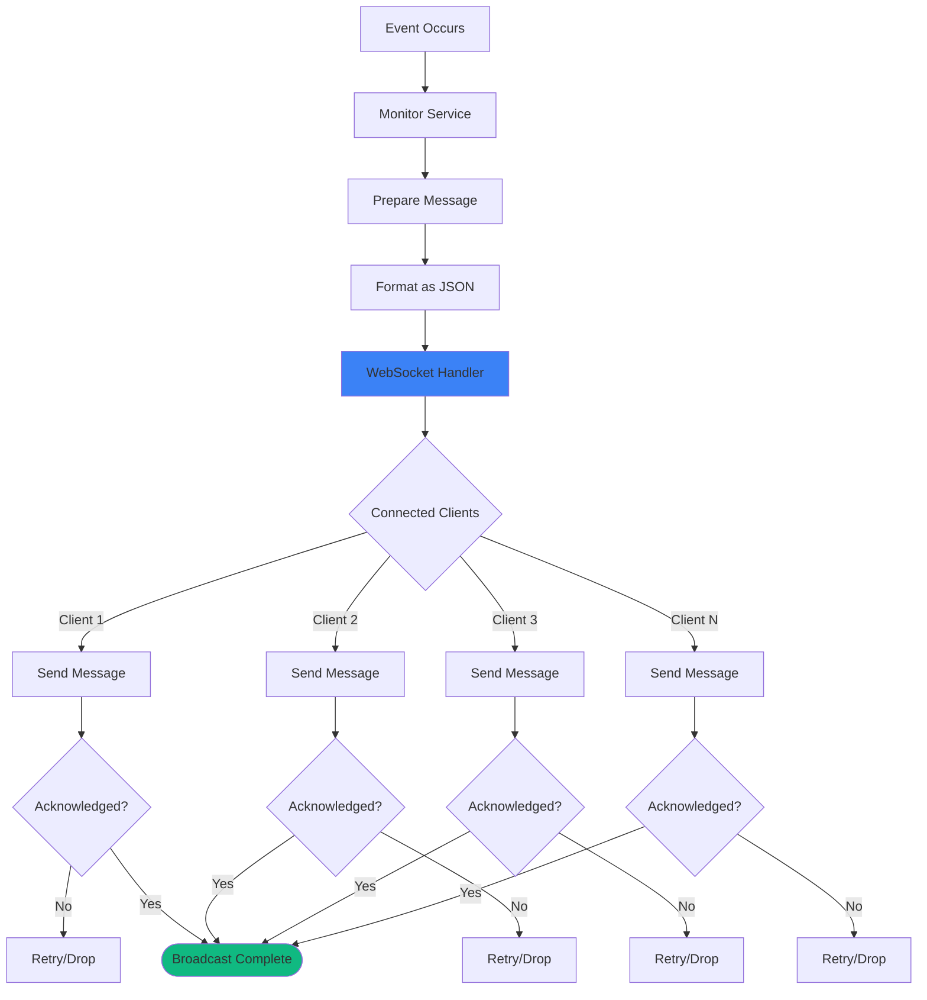

---

## API Request Flow

### REST API Request Lifecycle

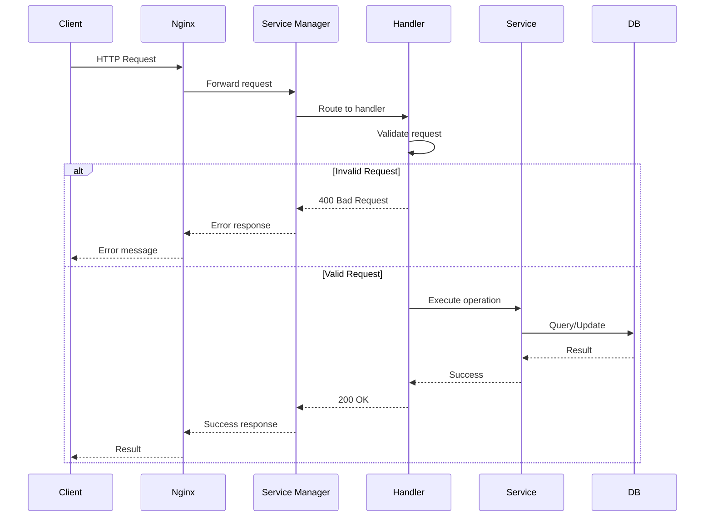

---

## Related Documentation

- [Architecture Overview](architecture-overview.md) - System architecture
- [Data Flow](data-flow.md) - Data movement through system
- [ARCHITECTURE.md](../../ARCHITECTURE.md) - Complete architecture guide

---

**Last Updated**: 2025-10-06  
**Maintained by**: Agent-Forge Team
