# Agent-Forge Data Flow

> **Detailed data flow diagrams showing how information moves through the system**

## Table of Contents

1. [Issue Processing Flow](#issue-processing-flow)
2. [Monitoring Data Flow](#monitoring-data-flow)
3. [Configuration Flow](#configuration-flow)
4. [WebSocket Message Flow](#websocket-message-flow)
5. [Git Operations Flow](#git-operations-flow)

---

## Issue Processing Flow

### Complete Issue Lifecycle

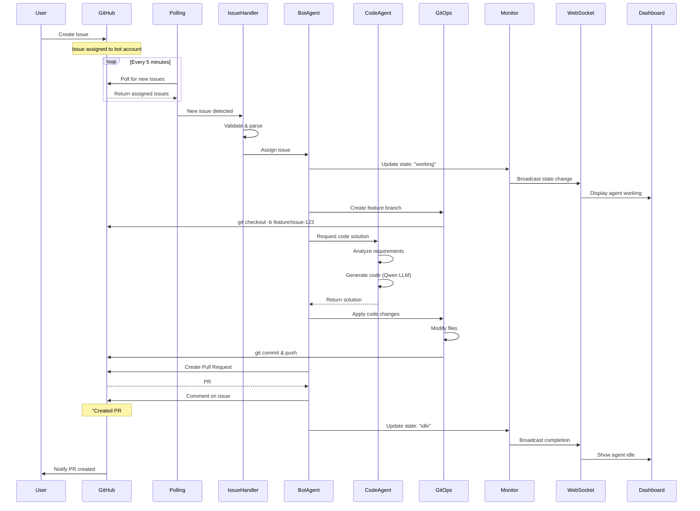

### Issue Processing States

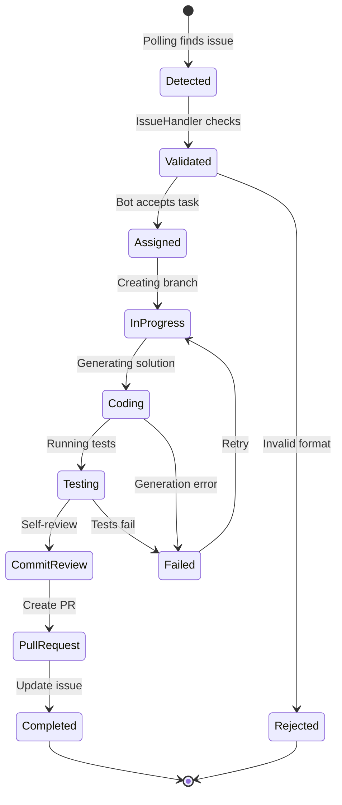

---

## Monitoring Data Flow

### Real-Time Agent State Updates

```mermaid
flowchart TD
    subgraph "Agent Layer"
        BA[Bot Agent]
        CA[Coordinator Agent]
        QA[Code Agent]
    end
    
    subgraph "Monitoring Layer"
        MS[Monitor Service]
        STATE[(Agent States)]
        METRICS[(Metrics DB)]
    end
    
    subgraph "Communication Layer"
        WS[WebSocket Handler<br/>Port 7997]
    end
    
    subgraph "Frontend Layer"
        DASH[dashboard.html]
        UNIFIED[unified_dashboard.html]
        MONITOR[monitoring_dashboard.html]
    end
    
    BA -->|update_agent()| MS
    CA -->|update_agent()| MS
    QA -->|update_agent()| MS
    
    MS --> STATE
    MS --> METRICS
    
    MS -->|broadcast()| WS
    
    WS -->|agent_state message| DASH
    WS -->|agent_state message| UNIFIED
    WS -->|agent_state message| MONITOR
    
    DASH -->|render| USER1[User Browser 1]
    UNIFIED -->|render| USER2[User Browser 2]
    MONITOR -->|render| USER3[User Browser 3]
```

### Log Streaming Flow

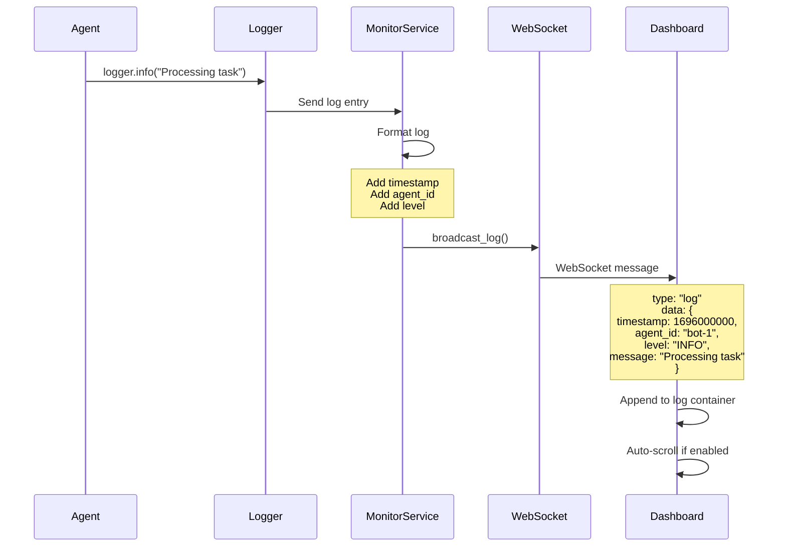

---

## Configuration Flow

### Configuration Update Process

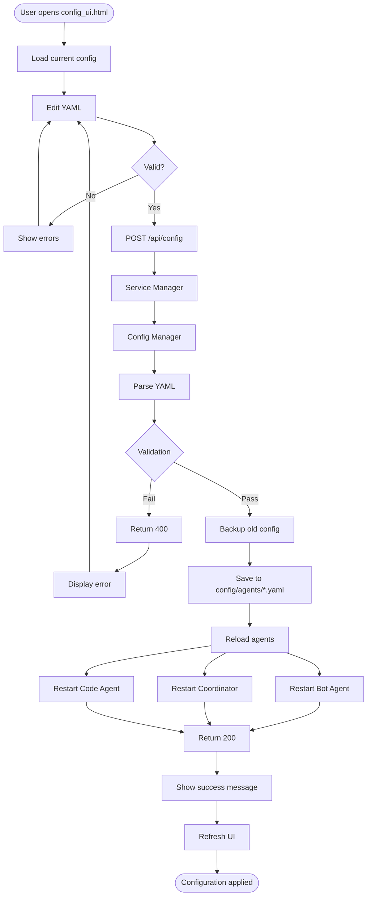

### Config File Hierarchy

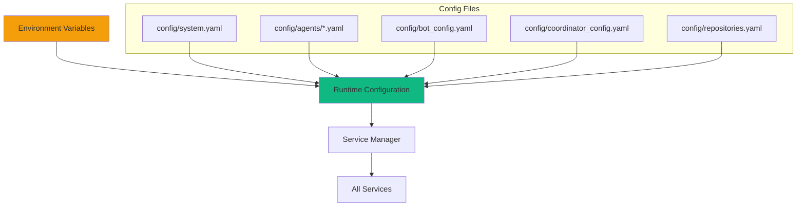

---

## WebSocket Message Flow

### Message Types and Flow

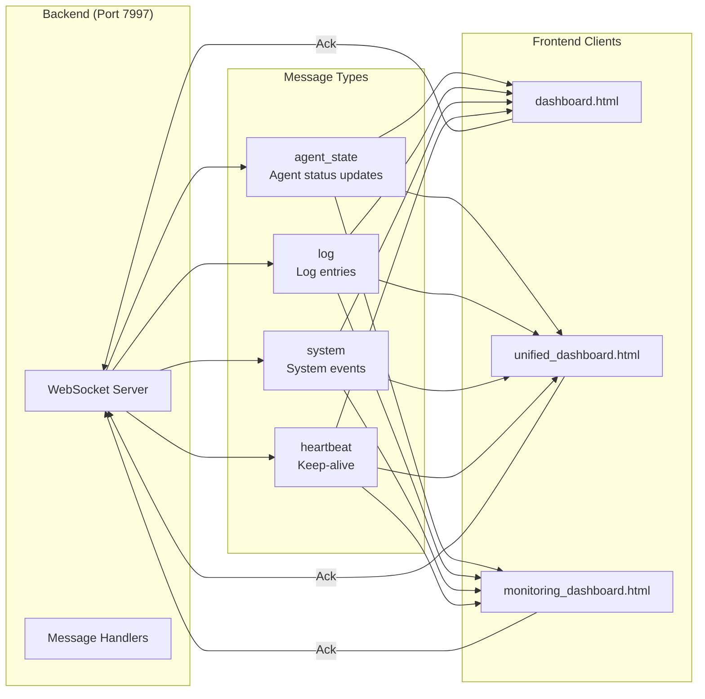

### WebSocket Connection Lifecycle

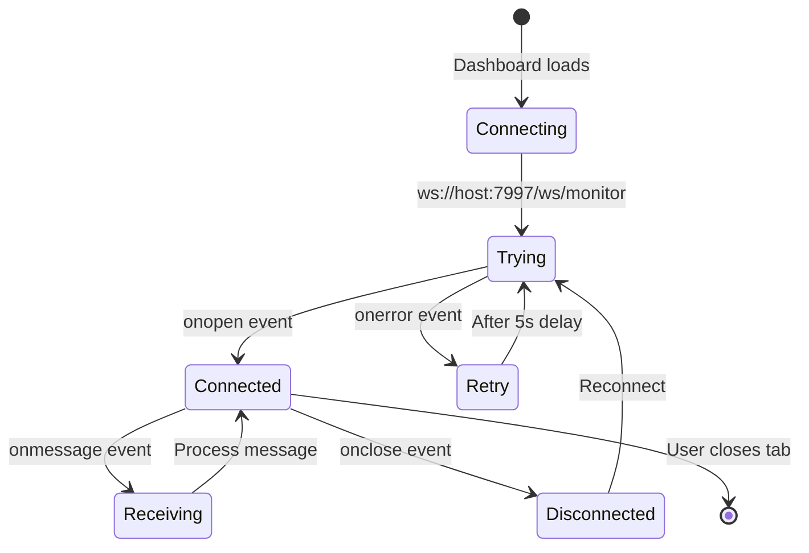

---

## Git Operations Flow

### Branch and Commit Flow

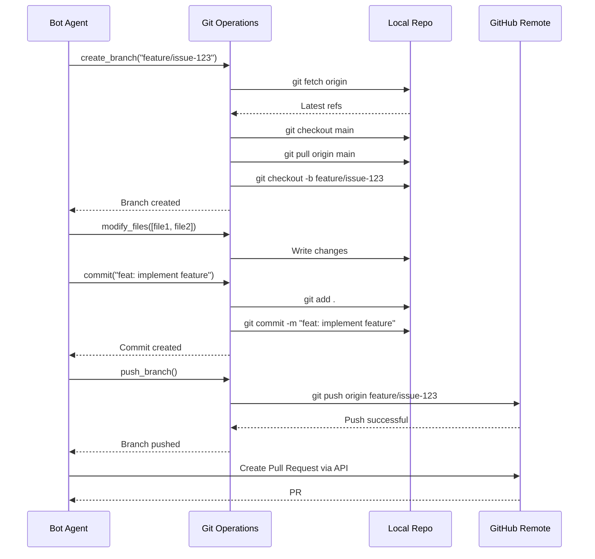

### Pull Request Review Flow

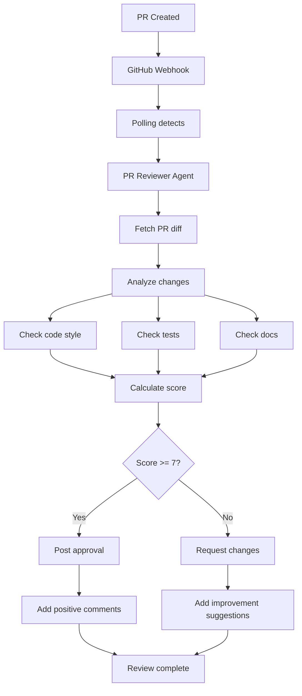

---

## Data Persistence

### Storage Locations

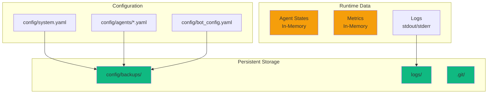

---

## Performance Considerations

### Rate Limiting Flow

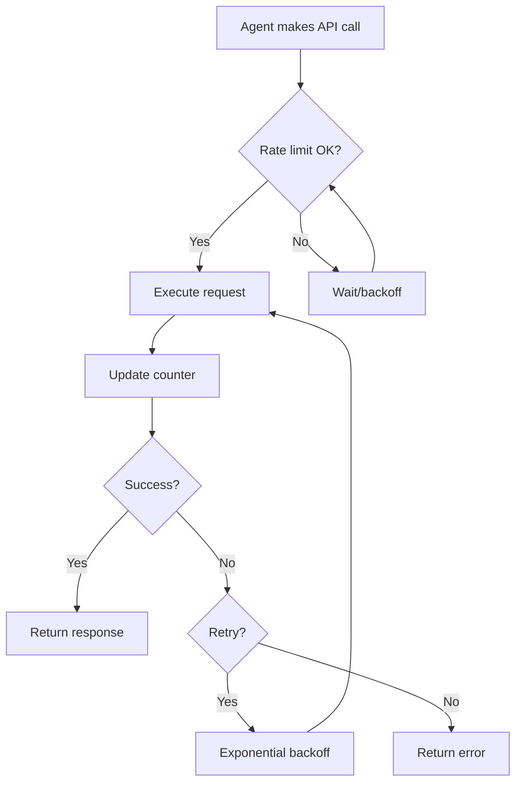

### Caching Strategy

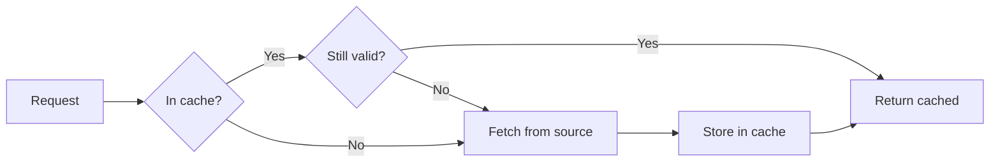

---

## Related Documentation

- [Architecture Overview](architecture-overview.md) - System architecture diagram
- [Component Interactions](component-interactions.md) - Component communication
- [ARCHITECTURE.md](../../ARCHITECTURE.md) - Complete architecture guide

---

**Last Updated**: 2025-10-06  
**Maintained by**: Agent-Forge Team
