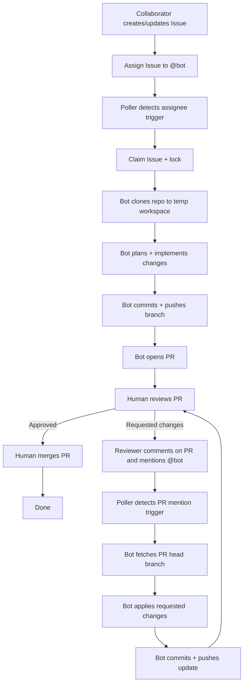

# Single Bot Workflow (Assignee + PR Mention Loop)

This document describes the minimal, practical workflow for running Agent-Forge as a **single coding agent** backed by **one Ollama model** and **one GitHub bot account**.

Goals:

- One in-flight LLM request at a time (constrained hardware)
- Trigger work by **assigning an issue** to the bot
- Iterate via **PR review comments** that mention the bot
- Keep **review + merge human-driven** (no auto-merge)

---

## High-level Flow



---

## Decision Points (Minimal Rules)

```mermaid
flowchart TD
  S[Incoming event] --> Q{Is it a PR?}

  Q -->|No (Issue)| R{Assigned to @bot?}
  R -->|No| X[Ignore]
  R -->|Yes| Y[Run Issue→PR pipeline]

  Q -->|Yes (PR)| T{Comment mentions @bot?}
  T -->|No| X
  T -->|Yes| Z[Run PR update pipeline]
```

---

## Responsibilities

```mermaid
flowchart LR
  subgraph GH[GitHub]
    GH1[Issue]
    GH2[Pull Request]
    GH3[PR Review Comments]
  end

  subgraph AF[Agent-Forge]
    AF1[Polling Service]
    AF2[Orchestrator]
    AF3[Git Workspace (temp)]
    AF4[LLM (Ollama)]
  end

  GH1 --> AF1
  GH3 --> AF1
  AF1 --> AF2
  AF2 --> AF3
  AF2 --> AF4
  AF2 --> GH2
```

---

## Notes / Intended Safety Properties

- The bot **does not merge**. A human merges after approval.
- The bot **does not auto-review**. Humans review.
- For constrained hardware, run with **1 concurrent issue** so only a single workflow runs at a time.
- The PR loop is explicit:
  - Human requests changes with a PR comment mentioning `@bot`.
  - Bot pushes a new commit.
  - Human reviews again.
